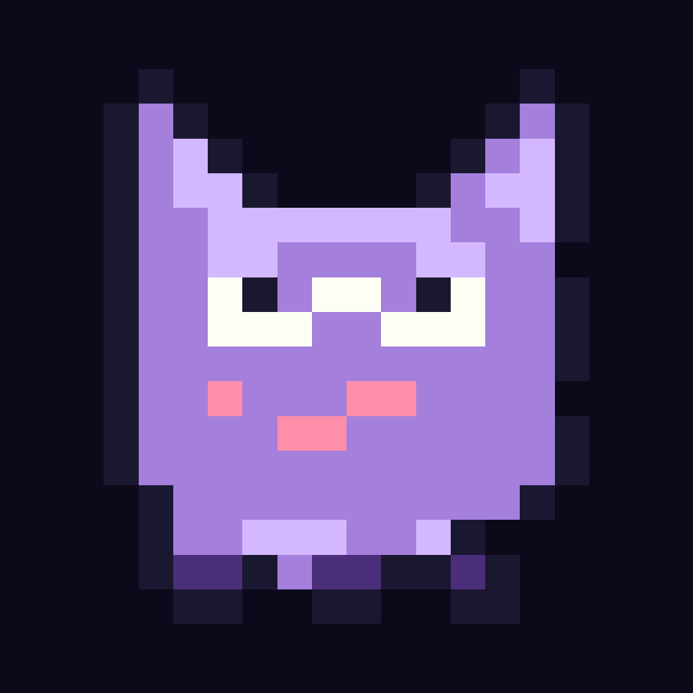

<p align="center">
  
</p>

<h1 align="center">PokeGuess — Retro Edition</h1>

<p align="center">
  <em>Adivinhe o Pokémon. Estilo Wordle, 898 criaturas, em pixel art retrô. Instalável como PWA.</em>
</p>

<p align="center">
  
  
  
  
  
</p>

<p align="center">
  
</p>

<p align="center">
  <a href="./assets/demo.mp4"><em>▶ Versão MP4 (HD)</em></a>
</p>

---

## ✨ Features

- 🎮 **3 modos de jogo**
  - **Normal** — tentativas infinitas até acertar
  - **Difícil** — 15 chutes
  - **Nightmare** — 6 chutes, sem dicas
- 🔢 **Filtro por geração** — escolha 1 a 8 gerações individualmente ou todas as 898 criaturas
- 🧠 **6 colunas de comparação** por chute — Tipo, Geração (ou Evolução), Cor, Habitat, Altura, Peso, com indicadores ↑↓ pras diferenças numéricas
- 💡 **Sistema de dicas** — após 10 chutes (Normal/Difícil), revele atributos do alvo um a um
- 🪄 **Coluna dinâmica GER ↔ EVO** — quando só 1 geração é selecionada, a coluna troca pra Estágio de Evolução automaticamente
- 📳 **Haptics** via `navigator.vibrate` (Android Chrome)
- 🔊 **Cries oficiais** dos Pokémon na vitória e derrota (via PokeAPI)
- 🎨 **Estética retrô** — Press Start 2P, sprites GB/GBA, paleta GB Color
- ⚡ **Prefetch inteligente** — as sugestões são pré-carregadas pra tap-to-submit ser instantâneo
- 📱 **PWA instalável** — service worker offline + manifest, funciona como app nativo
- 🌐 **108 KB gzipped** — bundle enxuto, carrega instantâneo

---

## 🕹️ Como jogar

1. **Tela inicial** — aperte ▶ PRESS START. O botão ⌗ no canto abre o menu de ajustes (modos, gerações, som, desistir).
2. **Digite o nome** da criatura no campo de busca. As sugestões aparecem com o sprite — toque na que quiser chutar.
3. **Cada chute revela 6 células** com cores:
   - 🟩 **Verde** — atributo bate exato
   - 🟨 **Amarelo** — atributo está perto (tipo sobreposto, ±1 geração, ±0.3m altura, ±8kg peso)
   - 🟥 **Vermelho** — errou
   - Setas **↑ / ↓** indicam se o alvo é maior ou menor (altura, peso, geração)
4. **Acerte antes** do limite de tentativas (depende do modo).
5. **No fim**: animação de vitória com cry da criatura + confete, ou tela de derrota com a criatura revelada.

---

## 🚀 Rodar localmente

Precisa de [Node.js 18+](https://nodejs.org/).

```bash
git clone https://github.com/KauanFortunato/PokeGuess.git
cd PokeGuess
npm install
npm run dev
```

Abre [http://localhost:5173](http://localhost:5173). O Vite mostra também o IP de rede pra testar no celular (mesma Wi-Fi).

### Build de produção

```bash
npm run build      # gera dist/
npm run preview    # serve o dist/ localmente pra testar
```

### Instalar como PWA

No Chrome (desktop ou Android): barra de endereço → ícone de "instalar".
No iPhone Safari: Compartilhar → "Adicionar à Tela de Início".

---

## 🛠️ Stack

| Camada | Tech |
| --- | --- |
| Build | [Vite 6](https://vitejs.dev/) |
| UI | [React 19.1](https://react.dev/) + [Tailwind CSS 3.4](https://tailwindcss.com/) |
| Animações | [framer-motion](https://www.framer.com/motion/) + CSS keyframes |
| PWA | [vite-plugin-pwa](https://vite-pwa-org.netlify.app/) (Workbox) |
| API | [PokeAPI](https://pokeapi.co/) (sprites, dados de espécies, cadeias de evolução, cries) |
| Áudio | HTML5 `Audio` API |
| Haptics | Web `navigator.vibrate` |
| Fontes | [@fontsource/press-start-2p](https://fontsource.org/) + [VT323](https://fontsource.org/) (self-hosted, sem CDN) |
| Helpers | [clsx](https://github.com/lukeed/clsx) |

---

## 📂 Estrutura

```
.
├── index.html
├── package.json
├── vite.config.js          # vite + plugin-pwa + plugin-react
├── tailwind.config.js      # tokens do tema (cores, fontes, keyframes)
├── postcss.config.js
├── public/
│   ├── icons/              # PWA icons (192, 512, 512-maskable)
│   └── img/                # creature.png (mascote da splash)
├── src/
│   ├── api/
│   │   ├── pokeApiService.js   # cliente PokeAPI: cache, prefetch, fetches paralelos
│   │   ├── randomPoke.js       # sorteia Pokémon respeitando o filtro de geração
│   │   ├── filterPoke.js       # filtra sugestões por nome + geração + prefetch
│   │   └── comparePoke.js      # lógica de comparação dos 6 atributos
│   ├── game/
│   │   ├── modes.js            # Normal / Difícil / Nightmare
│   │   ├── gens.js             # ranges de gerações 1-8 e helpers
│   │   ├── feedback.js         # navigator.vibrate + mute global
│   │   └── sound.js            # cries via HTML5 Audio
│   ├── screens/
│   │   ├── Splash.jsx          # tela inicial: silhuetas + mascote + POKE/GUESS
│   │   ├── Game.jsx            # board 6×6, FlipCell, input com sugestões
│   │   ├── Win.jsx             # orb spin + creature reveal + confete + cry
│   │   ├── Lose.jsx            # shake + revelação da criatura
│   │   └── Settings.jsx        # modal de ajustes
│   ├── components/
│   │   ├── Board.jsx
│   │   ├── FlipCell.jsx        # 3D rotateX flip via CSS
│   │   ├── GuessRow.jsx
│   │   └── InputRow.jsx
│   ├── App.jsx                 # state machine (splash → game → win/lose)
│   ├── main.jsx                # entry point
│   └── index.css               # Tailwind base + reset
└── assets/                     # README assets (logo, demo.gif, demo.mp4)
```

---

## 🤝 Créditos

- **Sprites & dados dos Pokémon** — [PokeAPI](https://pokeapi.co/) (sprites GB/GBA + official artwork + species + cries)
- **Fontes** — [Press Start 2P](https://fonts.google.com/specimen/Press+Start+2P) por CodeMan38 e [VT323](https://fonts.google.com/specimen/VT323) por Peter Hull

---

## 📝 Licença

[MIT](./LICENSE.txt). Pokémon e seus nomes são marcas registradas da Nintendo / Game Freak — este é um projeto educacional sem fins lucrativos.
